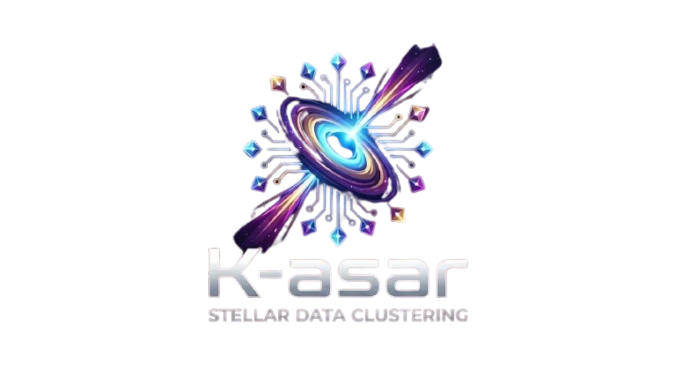

# k-sar



**K-asar: Stellar Data Clustering** — Análisis no supervisado de datos estelares con dashboard interactivo

🚀 **[Ver la app en vivo](https://k-sar-production.up.railway.app/)**

## Descripción del Proyecto

Proyecto de segmentación no supervisada para análisis y agrupamiento de datos estelares (astronomía). El objetivo es identificar grupos naturales en el espacio de características espectrales de los objetos y ofrecer una interfaz interactiva para explorar los resultados.

**Características principales:**
- 📊 **Pipeline completo** de ML: preprocesamiento, reducción de dimensionalidad (PCA), clustering (K-Means)
- 🎯 **Dashboard interactivo**: visualiza resultados del modelo en tiempo real en el navegador
- 🚀 **App desplegada**: alojada en Railway con actualización automática desde GitHub
- 📐 **Reproducibilidad**: todos los parámetros del modelo están documentados y exportados

## Dataset

Usamos el dataset **"Stellar Classification Dataset (SDSS17)"** disponible en Kaggle:  
https://www.kaggle.com/datasets/fedesoriano/stellar-classification-dataset-sdss17

### Datos en producción (actualizados)

La app desplegada en https://k-sar-production.up.railway.app/ utiliza los datos exportados al archivo `src/public/data/dashboard_data.json`. Resumen rápido de los metadatos actuales incorporados en la app (extraído del JSON de producción):

- Total de registros originales: 100000
- Registros válidos tras limpieza: 99999 (n_invalid_removed: 1)
- Conteo por clase: GALAXY=59445, STAR=21593, QSO=18961
- K final empleado en la demo: 3
- Componentes PCA para explicar ~90% varianza: 4 (var_90 ≈ 0.9036)

Si querés inspeccionar el JSON completo: `src/public/data/dashboard_data.json` (versión incluida en el repo y servida por la app en producción):

https://github.com/yohperez/k-sar/blob/main/src/public/data/dashboard_data.json

> Nota: estos números reflejan el último `dashboard_data.json` exportado y desplegado en Railway. Si actualizás el pipeline (notebooks/), regenerá este JSON con los mismos pasos de preprocesamiento (RobustScaler + PCA al 95% + K-Means) para que la demo reproduzca exactamente el modelo.

### Configuración local

Ruta esperada en el repositorio:

```
data/stellar_classification.csv
```

**Instrucciones:**
1. Descarga el CSV desde Kaggle (enlace arriba)
2. Guarda el archivo en `data/stellar_classification.csv` dentro del repo (crea la carpeta `data/` si no existe)

## Estructura del Repositorio

```
k-sar/
├── notebooks/                                  # Pipeline completo de ML (Jupyter Notebooks)
│   ├── 00_business_case.ipynb                 # Caso de negocio y contexto del análisis
│   ├── 01_exploratory_data_analysis.ipynb      # Análisis Exploratorio de Datos (EDA)
│   ├── 02_data_preprocessing.ipynb             # Preprocesamiento y limpieza de datos
│   ├── 03_dimensionality_reduction.ipynb       # Reducción de dimensionalidad con PCA
│   ├── 04_modeling.ipynb                       # Clustering con K-Means y selección de K óptimo
│   ├── 04_modeling_test_nopca.ipynb            # Análisis alternativo sin PCA
│   ├── 05_business_translation_and_ethics.ipynb # Traducción al negocio, interpretabilidad y ética
│   └── data/                                   # Datos intermedios del pipeline
├── src/                                        # Dashboard interactivo (Node.js/Express)
│   ├── server.js
│   ├── package.json
│   ├── railway.json                            # Configuración de Railway
│   └── public/
│       ├── index.html                          # Dashboard
│       ├── css/style.css
│       ├── js/app.js
│       ├── data/dashboard_data.json            # Datos del modelo (usados en producción)
│       └── assets/
├── data/                                       # Datasets (descarga aquí el CSV)
├── assets/                                     # Logos y recursos
└── README.md
```

## Dashboard Interactivo

La app está **completamente funcional** y desplegada en:  
🔗 https://k-sar-production-up.railway.app/

### Características del dashboard:
- 📊 Visualización interactiva de clusters en 2D (PCA)
- 📈 Gráficos de distribución y análisis de características
- 🎛️ Reproducción del modelo directamente en el navegador
- 📱 Responsive y sin dependencias externas (CDNs)

### Correr localmente

```bash
cd src
npm install
npm start
# Abrir http://localhost:3000
```

### Desplegar cambios en Railway

La app se redeploya automáticamente cuando hay cambios en `src/` en la rama `main`. El flujo es:

1. Haz cambios en cualquier archivo dentro de `src/`
2. Haz push a `main`
3. Railway detecta el cambio y redeploya automáticamente
4. En 1-2 minutos, los cambios están disponibles en https://k-sar-production-up.railway.app/

## Equipo de Trabajo

| Rol | GitHub |
|-----|--------|
| **Contexto de Negocio** | [@yohperez](https://github.com/yohperez) |
| **Análisis Exploratorio (EDA)** | [@JCRbit](https://github.com/JCRbit) |
| **Preprocesamiento de Datos** | [@luiselallali18-hub](https://github.com/luiselallali18-hub) |
| **Reducción de Dimensionalidad (PCA) & Modelado** | [@Isabela-Tellez](https://github.com/Isabela-Tellez) |
| **Clustering y Modelo** | [@SiR0N](https://github.com/SiR0N) |

## Flujo de Trabajo (Pull Requests)

1. Cada colaborador crea una rama propia:
   ```bash
   git checkout -b feature/nombre-tarea
   ```

2. Realiza sus cambios y hace push:
   ```bash
   git push origin feature/nombre-tarea
   ```

3. Abre un **Pull Request** en GitHub dirigido a `main`

4. El equipo revisa el código y aprueba el merge

5. ✅ Una vez merged a `main`:
   - Si hay cambios en `notebooks/`: se actualiza el análisis
   - Si hay cambios en `src/`: la app se redeploya automáticamente en Railway

## Tecnologías

- **Análisis de datos**: Python, Pandas, NumPy, Scikit-learn, Matplotlib, Seaborn
- **Dashboard**: Node.js, Express, Chart.js, HTML5/CSS3
- **Deployment**: Railway (CI/CD automático)
- **Versionado**: Git & GitHub

## Mejoras Implementadas

✅ **App desplegada en producción** con actualizaciones automáticas  
✅ **Dashboard interactivo** con visualización de clusters en 2D  
✅ **Pipeline reproducible** con parámetros documentados  
✅ **Datos exportados** en JSON para consumo frontal  
✅ **Arquitectura modular** (notebooks + app separados)  
✅ **CI/CD automático** con Railway

## Próximos Pasos

- [ ] Agregar más análisis ético en la traducción al negocio
- [ ] Comparar con otros algoritmos de clustering
- [ ] Mejorar visualizaciones 3D
- [ ] Agregar endpoints de API para integración
